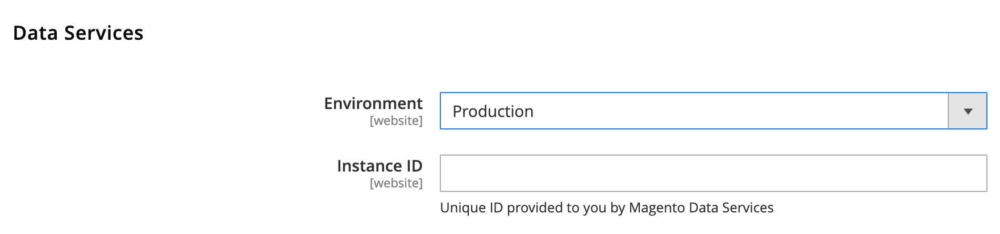

# Announcing Early Enrollment for Product Recommendations Powered by Adobe Sensei

 * [Feature Roll-out Plan](#feature-roll-out-plan)
   * [What We Ask of You](#what-we-ask-of-you)
 * [How to Enroll](#how-to-enroll)
   * [To Install the ServicesID and DataServices Modules for On-premise using Git](#to-install-the-ServicesID-and-dataservices-modules-for-on-premise-using-git)
   * [To Install the ServicesID and DataServices Modules for Magento Commerce Cloud using Git](#to-install-the-ServicesID-and-dataservices-modules-for-magento-commerce-cloud-using-git)
   * [To Install the DataSerices Module using Composer](#to-install-the-dataservices-module-using-composer)
   * [Configure Your Environment](#configure-your-environment)
   * [Verify Data is Being Captured](#verify-data-is-being-captured)
   * [DataServices Events List](#dataservices-events-list)
 * [How to Uninstall the DataServices Module](#how-to-uninstall-the-dataservices-module)
 * [Send Feedback to Magento](#send-feedback-to-magento)

For the list of available recommendation types* and the storefront pages where the recommendations will be available*, see the following [page](https://gist.github.com/misha-kotov/c03df9039eb0f6c21ff47e0c9d76ae48#introduction).

## Feature Roll-out Plan

* Summer 2019
  * Merchants install DataServices module on production sites
  * The DataServices module gathers behavioral data and sends that data to Magento
  * Magento builds and trains Adobe Sensei machine learning models for each participating merchant
  * Feature is in active development
* Fall 2019*
  * Magento rolls out the Recommendations API for storefronts
* Early 2020*
  * Magento rolls out early feature access with Product Recommendations management UI in the Admin
* 2020*
  * Product Recommendations powered by Adobe Sensei General Availability

&ast;*Dates and scope are subject to change*

### What We Ask of You

Throughout development, we ask that that you:

* Update the DataServices module, when requested, as we iterate to ensure all necessary data is collected to build recommendations.
* Commit time and resources. We will reach out for formal feedback, but also feel free to reach out at any time as described in the **Send Feedback to Magento** section below.

## How to Enroll

For this Early Enrollment phase, we are asking merchants to install the ServicesId and DataServices modules on their storefront pages. These modules will enable the flow of data from the storefront and allow for machine learning models to be built and trained.

### To Install the ServicesID and DataServices Modules for On-premise using Git

To begin collecting behavioral data, you must install the ServicesId and DataServices modules.

1. Change to the `Magento` directory.
  ```
  cd <magento directory>
  ```

2. Clone the `Magento/data-solutions-services-id` repository.
  ```
  git clone git@github.com:magento/data-solutions-services-id.git app/code/Magento
  ```

3. Clone the `Magento/DataServices` repository.
  ```
  git clone git@github.com:magento/data-services-eap app/code/Magento
  ```

4. Enable the Magento ServicesId module.
  ```
  bin/magento module:enable Magento_ServicesId
  ```

5. Enable the Magento DataServices module.
  ```
  bin/magento module:enable Magento_DataServices
  ```

6. Update any components.
  ```
  bin/magento setup:upgrade
  ```

7. Compile any components that were updated.
  ```
  bin/magento setup:di:compile
  ```

8. Clean the cache after update.
  ```
  bin/magento cache:clean
  ```

9. Refer to the **Configure Your Environment** section below.

### To Install the ServicesID and DataServices Modules for Magento Commerce Cloud using Git

To begin collecting behavioral data, you must install the ServicesId and DataServices modules.

1. Log into your local development system. Make sure you are in your development environment.


2. Change to the Magento root directory.
  ```
  cd <magento directory>
  ```
  
3. Clone the `Magento/data-solutions-services-id` repository.
  ```
  git clone git@github.com:magento/data-solutions-services-id.git app/code/Magento
  ```

4. Clone the `Magento/DataServices` repository.
  ```
  git clone git@github.com:magento/data-services-eap app/code/Magento
  ```

5. Remove the .git directory in the `Magento` directory.
  ```
  rm -rf app/code/Magento/.git
  ```

6. Deploy the DataServices module to your remote Cloud environment.
  ```
  git add -A && git commit -m "Install DataServices Module" && git push
  ```

7. Refer to the **Configure Your Environment** section below.

### To Install the DataServices Module using Composer

Update your `composer.json` file in the Magento root installation directory to provide the location of the DataServices module.

1. Log in to your Magento server as, or switch to, the Magento file system owner.

2. Change to your Magento root directory.

3. Enter the following commands:
```
composer config repositories.magento composer https://repo.magento.com
composer require magento/module-data-services
```
4. Follow the steps [here](https://devdocs.magento.com/extensions/install/#verify-the-extension) to verify and enable the module.

### Configure Your Environment

After you have installed the DataServices module, you need to configure your environment to ensure the data being collected is coming from a production storefront rather than a storefront under test.

1. On the Admin sidebar, tap **Stores**. Then under **Settings**, choose **Configuration**.
2. In the panel on the left under **Services**, choose **Data Services**.
3. Expand the **Data Services** section.
4. In the **Environment** drop-down, select either **Testing** or **Production**. Starting with version 3.0.2, the **Instance ID** field is auto-populated. Earlier versions required that you manually enter this ID.



**Note** By explicitly setting the environment for data collection, Magento excludes testing data, such as load testing, from the calculations used to generate the recommendations. If you set the **Environment** to **Production** on a development site, the data Magento gathers to train the ML models and generate recommendations will not be accurate.

### Verify Data is Being Captured

After you configure your storefront, verify that the behavorial data is being sent to Magento:

1. Make sure you disable any ad blocker on your browser.
2. Install the [Snowplow Event Tracker extension for Chrome](https://chrome.google.com/webstore/detail/snowplow-inspector/maplkdomeamdlngconidoefjpogkmljm). This extension displays the events being collected and sent to Magento.
3. To see the flow of events in the tracker, go to your production website and click on products, categories, etc.

### DataServices Events List

The following table lists the events the DataServices module tracks.

Event |Description
--- | ---
`add-to-cart` | Triggered when the customer adds an item to their cart
`add-to-wishlist` | Triggered when the customer adds an item to their wishlist
`apply-discount-action` | Triggered when the customer applies a discount to a cart
`edit-product-qty` | Triggered when the customer modifies the number of items in their cart
`initiate-checkout` | Triggered when the customer clicks the **Proceed to Checkout** button
`instant-purchase` | Triggered when the customer selects the **Add to Cart** button on a category page
`place-order` | Triggered when the customer clicks the **Place Order** button
`remove-discount-action` | Triggered when the customer removes a discount from a cart
`remove-from-cart` | Triggered when the customer removes an item from their cart
`remove-from-wishlist` | Triggered when the customer removes an item from their wishlist
`sign-in` | Triggered when the customer signs into their account
`sign-out` | Triggered when the customer signs out of their account
`view` | Triggered when the customer views a specific item on the products page

## How to Uninstall the DataServices Module
If for any reason you need to uninstall the ServicesId and DataServices modules, follow the steps [here](https://devdocs.magento.com/guides/v2.3/install-gde/install/cli/install-cli-uninstall-mods.html#instgde-cli-uninst-mod-uninst).

## Send Feedback to Magento

As we continue to evolve this technology and ensure you are successful in implementing product recommendations, it is critical that we address any issues you encounter and plan for any feature requests.

You can send us feedback by one of the following methods:
* Email: magento-product-recs-feedback@adobe.com
* Slack: Sign up [here](http://tinyurl.com/engcom-slack) to access the `#product-recs` (private) group on Magento Community Engineering
